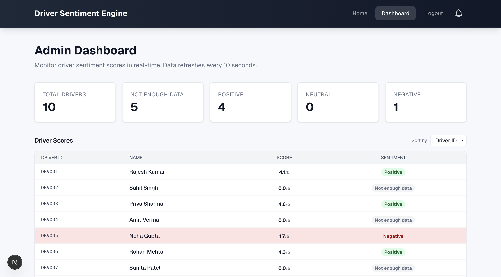

# Driver Sentiment Engine

A Project for analyzing driver performance through employee feedback. Features real-time sentiment analysis, JWT role-based authentication, and a non-blocking asynchronous queue for processing feedback. Built with **Express.js + TypeScript** on the Backend and **Next.js + Tailwind CSS** on the Frontend, backed by **MongoDB**.

This system was engineered with a focus on **algorithm efficiency, data structure optimization, and clean architecture (OOP).**

## Key Features

- **Real-time Sentiment Analysis**: Instantly categorizes text feedback into positive/neutral/negative ratings using a localized natural language processing bag-of-words approach, mathematically blended with quantitative star ratings.
- **Secure Authentication & Role-Based Access (JWT)**: Login system utilizing bcrypt password hashing and JSON Web Tokens. Admin vs. Employee roles dictate strict, isolated UI routing and component rendering.
- **Dynamic Feature Flags**: Centralized config system allows toggling UI components (like marshal feedback) on the fly without deploying new code.
- **Asynchronous Task Processing**: Real-time feedback submission with non-blocking, background queue processing for data persistence and alerting.

## Technical Highlights

### 1. Data Structures & Algorithm Efficiency
- **$O(1)$ Sentiment Word Lookup containing Hash Sets**: The Sentiment Analysis Engine relies on predefined dictionaries. Instead of using arrays (which run in $O(N)$), we utilize `Set<string>` structures mapped in isolated memory, enabling instant $O(1)$ lookups per localized tokenized word.
- **Amortized $O(1)$ In-Memory Queue**: Feedback processing is completely decoupled from the HTTP response cycle using an asynchronous FIFO `InMemoryQueue<T>`. This allows instant feedback submission for users, while heavy sentiment crunching and database writes happen sequentially in the background worker.

### 2. Architecture & Design
- **Repository Pattern**: Controllers handle HTTP schemas, Services contain business logic, and Repositories handle MongoDB transactions.
- **Singleton Pattern**: Built a `Database` connection class strictly enforcing a single MongoDB connection pool across the application lifecycle to prevent memory leaks and max connection limits.
- **Dependency Injection**: Root `Server.ts` explicitly wires all Repositories, Services, and Controllers together at boot via Constructors.

## Screenshots

| Home Page | Feedback Flow |
|---|---|
|  |  |
| **Admin Dashboard** | **Driver's Score Graph** |
|  |  |

## Tech Stack

- **Frontend**: Next.js (React), Tailwind CSS
- **Backend**: Node.js, Express.js, TypeScript
- **Database**: MongoDB (Mongoose)

## Quick Start

### Prerequisites
- Node.js 18+
- MongoDB

### 1. Backend Setup
```bash
cd backend
npm install
# Ensure MongoDB is running locally or provide a MONGO_URI in .env
npm run dev
```

### 2. Frontend Setup
```bash
cd frontend
npm install
npm run dev
```

### 3. Login
- **Admin**
- **Employee**